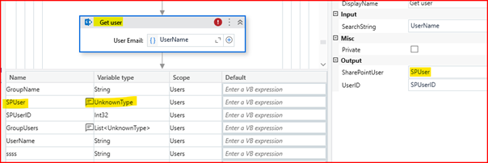
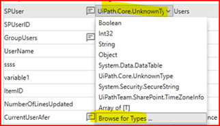
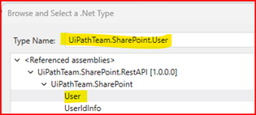
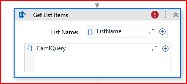
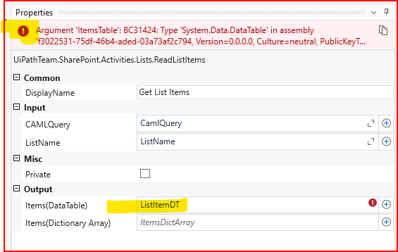

# UiPathTeam.SharePoint.Activities version 2.0
Source Code for the UiPathTeam.SharePoint.Activities Custom activities listed in https://marketplace.uipath.com/listings/sharepoint-custom-activities-package

# Migration from .NET Framework (Windows-Legacy) to .NET 8 (Windows) Package Version >= 2.0.0

## Overview
This guide is for users migrating from Package version `<= 1.7 (Windows-Legacy)` to version `>= 2.0 (Windows)`. Version 2.0 introduces a major update, transitioning the project from **.NET Framework** to **.NET 8**. The integration now leverages the **SharePoint REST API** instead of the legacy `Microsoft.SharePoint2016.CSOM` runtime.

---

## Key Updates

- **Runtime Upgrade**:  
  Migrated from .NET Framework to .NET 8 to enable Windows-Legacy RPA processes that depend on the old `UiPathTeam.SharePoint.Activity` to seamlessly transition to Windows projects.

- **API Transition**:  
  Replaced `Microsoft.SharePoint2016.CSOM` with the modern **SharePoint REST API**, aligning with current web standards.

- **New Dependencies**:  
  The following dependencies are automatically resolved during package installation:  
  - `Microsoft.AspNet.WebApi.Client` (6.0.0)  
  - `Microsoft.Identity.Client` (4.70.0)  
  - `Newtonsoft.Json` (13.0.3)  

---

## Testing & Production Readiness
While extensive testing has been conducted on all activities, we **strongly recommend** that customers perform their own tests in a controlled environment before deploying to production. This ensures the new integration aligns with your specific workflows.

---

## Post-Migration Steps

### 1. Update Output Variable Type
If your Studio project uses any of the following activities, update the output variable types as shown below:

| **Activity**              | **Output Property** | **New Variable Type**                  |
|---------------------------|---------------------|----------------------------------------|
| Get User                  | SharePointUser      | `UiPathTeam.SharePoint.User`           |
| Get All Users From Group  | Result              | `List<UiPathTeam.SharePoint.User>`     |
| Get Web Login User        | SharePointUser      | `UiPathTeam.SharePoint.User`           |
| Get TimeZone              | SharePointTimeZone  | `UiPathTeam.SharePoint.TimeZoneInfo`   |

#### Example: Updating the Output Variable for "Get User" Activity

 

 

### 2. Remove and Retype output variable
If your project is using `Get List Items` activity, you might see some error icon on the activity. You can resolve it by simply emptying the output variable name of the activity, click Enter, and type/paste the variable name again.

 

### 3. QueryGrouping Is Not Supported
During testing QueryGrouping with the old package version 1.7, it was noticed that QueryGrouping was not implemented. Thus, we did not implement batching in the new packages since existing clients probably are not using it. The Property QueryGrouping was kept visiable on the properties panel to avoid any migration issue.
